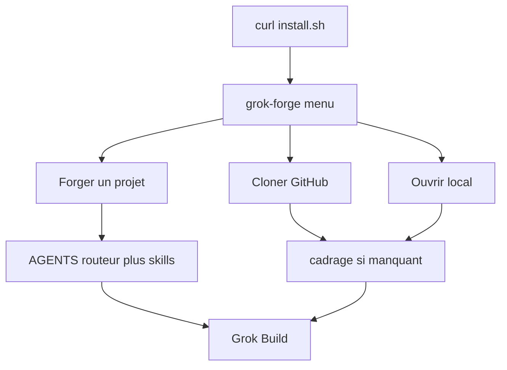
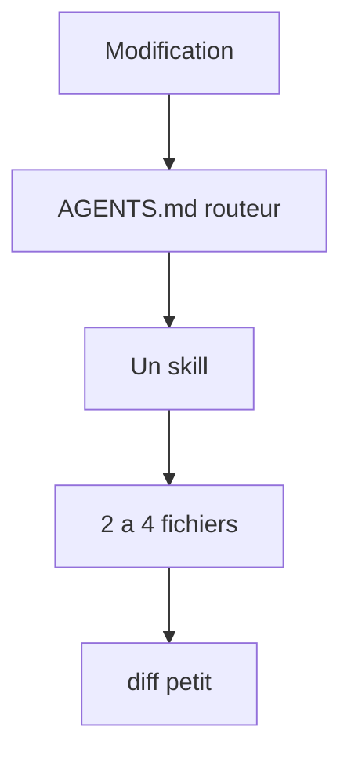

# Grok Forge

Installateur unifié et **menu terminal** (SSH-friendly) pour travailler avec [Grok Build](https://x.ai/build) : installer les outils, forger un nouveau projet, ou cloner un dépôt déjà présent sur ton compte GitHub, puis laisser Grok coder et pousser proprement.

Cible : **Ubuntu / Linux**, stacks **Python**, **npm**, ou les deux. Aucune interface plein écran : listes numérotées, questions, plan à valider. Fonctionne en local et via SSH.

Repo public : [palarchsys/grok-forge](https://github.com/palarchsys/grok-forge)

Grok lit **`AGENTS.md` seulement** au départ : c’est un **routeur**. Les procédures vivent dans `.grok/skills/` et ne s’ouvrent que si la table le dit. Ça limite les tokens à chaque modification.

---

## Installation (une ligne)

Dans un terminal Linux (ou une session SSH) :

```bash
curl -fsSL https://raw.githubusercontent.com/palarchsys/grok-forge/main/install.sh | bash
```

Le script est **interactif** (il lit le clavier même via `curl | bash`). Il ne demande **aucun flag**.

Il va, dans l’ordre, si ce n’est pas déjà fait :

1. Installer les paquets de base (`git`, `curl`, `python3`, compilateur, etc.)
2. Installer **GitHub CLI** (`gh`) et proposer `gh auth login`
3. Installer **Grok Build** (`curl -fsSL https://x.ai/cli/install.sh | bash`)
4. Proposer **uv** (Python) et **Node LTS** via fnm
5. Cloner / **mettre à jour** cet outillage dans `~/.local/share/grok-forge` (`git reset --hard` : c’est un clone d’outils, pas un projet)
6. Créer la commande `grok-forge` dans `~/.local/bin`

À la fin : *ouvrir le menu maintenant ?* → oui.

Les fois suivantes :

```bash
grok-forge
```

Le lanceur **tire tout seul** une mise à jour si `origin/main` a avancé, puis ouvre le menu.

Navigation : tape **1**, **2**, **3** ou **q**, puis Entrée. Les listes de repos / projets sont numérotées. `0` revient en arrière.

Pour forcer une mise à jour manuelle (clone d’**outillage** seulement — tes projets dans `~/GrokForge` ne bougent pas) :

```bash
cd ~/.local/share/grok-forge && git fetch origin && git reset --hard origin/main && grok-forge
```

---

## Cycle





Détail : [`docs/lifecycle.md`](docs/lifecycle.md). Carte : [`docs/map.md`](docs/map.md).

---

## Menu principal

Pas de TUI, pas de souris. Un écran SSH classique :

```
----------------------------------------
  Grok Forge
  Grok OK  |  gh OK  |  /home/toi/GrokForge
----------------------------------------

  1  Forger un nouveau projet
     Python, npm ou fullstack — plan a valider avant ecriture.

  2  Cloner un repo GitHub
     Tes depots -> ~/GrokForge -> cadrage si manquant -> Grok.

  3  Ouvrir un projet local
     Reprendre un dossier deja present dans ~/GrokForge.

  q  Quitter
     Tes projets restent en place.

  Choix [1] :
```

| Choix | Effet |
| --- | --- |
| **1 Forger** | Nom, type (CLI Python, API FastAPI, npm/Vite, fullstack, systemd), options GitHub. **Plan affiché** → tu tapes `y` avant toute écriture. Pose AGENTS.md routeur + skills + mermaid. Un cadrage déjà présent n’est jamais écrasé. |
| **2 Cloner** | Liste tes dépôts, numéro → clone (ou `git pull --ff-only` s’il est déjà là) → cadrage **s’il manque** → Grok |
| **3 Local** | Liste `~/GrokForge`, numéro → cadrage si besoin → `grok` |
| **q** | Ferme le menu. Tes projets restent. |

Rien n’est écrit tant que tu n’as pas **approuvé le plan** (nouveau projet). Un `AGENTS.md` déjà présent n’est **jamais écrasé**.

---

## Types de projet

1. `python-cli` — outil / service Python
2. `python-web` — API (FastAPI par défaut)
3. `npm-web` — app Node
4. `fullstack` — backend Python + frontend npm
5. `linux-system` — scripts et units systemd

Chaque projet reçoit notamment :

- `AGENTS.md` — **routeur** (table : quelle skill ouvrir)
- `.grok/skills/{git,session,python,npm,linux}/SKILL.md` — procédures courtes
- `docs/lifecycle.md` — mermaid
- `docs/map.md` — carte des fichiers
- `install.sh` — seul point d’entrée local
- `install.ps1` seulement si tu as dit oui à Windows
- socle Python / npm selon le type

Les **projets** vivent dans `~/GrokForge/`.  
L’**outillage** (ce dépôt) vit dans `~/.local/share/grok-forge`.

---

## Git : créer, cloner, pousser

### Nouveau projet

- Si `gh` est connecté et que tu as accepté « créer le repo » : `gh repo create` + `git push -u origin main` pour le bootstrap.
- Ensuite le travail agent se fait sur `grok/<sujet>`, pas un force-push sur `main`.

### Repo déjà existant

Menu → `2` → numéro du dépôt → `gh repo clone` (ou pull si le dossier existe).  
Le remote `origin` est déjà le bon. Grok ouvre **dans** ce dossier.

### Fin de session

```bash
cd ~/GrokForge/ton-projet
.grok/hooks/session-wrap.sh "titre court"
```

Jamais de `--force` sur `main`. Jamais de `.env`, `.venv`, `node_modules` dans git.

---

## Relancer un projet depuis Git (machine neuve)

Sur le **projet** forgé, pas sur grok-forge :

```bash
git clone https://github.com/palarchsys/TON-PROJET.git
cd TON-PROJET
chmod +x install.sh
./install.sh
```

---

## Fichiers de ce dépôt

| Fichier | Rôle |
| --- | --- |
| `AGENTS.md` | Routeur pour Grok Build sur **ce** dépôt |
| `install.sh` | Bootstrap unifié (Grok Build + forge), interactif |
| `setup-grok-forge` | Menu terminal (nouveau / clone / local) |
| `setup-grok-forge.sh` | Backend : génération du projet, git, GitHub |
| `forge_tui.py` | Shim : ancien lanceur TUI, redirige vers le menu |
| `templates/apply-framing.sh` | Pose le cadrage sans écraser |
| `templates/project/` | AGENTS + skills + mermaid copiés dans chaque projet |
| `.grok/skills/` | Skills de **ce** dépôt |
| `docs/lifecycle.md` | Cycle mermaid |
| `docs/map.md` | Carte |

---

## Prérequis

- Linux (Ubuntu 26.04 visé, Debian-like accepté)
- Compte [xAI / SuperGrok](https://x.ai) pour Grok Build
- Compte GitHub + `gh auth login` pour lister / créer / pousser tes repos
- Terminal ou session SSH (TTY)

Aucun secret n’est stocké dans ce dépôt. L’auth GitHub passe par `gh` sur ta machine. L’auth Grok Build passe par le login officiel du CLI.

---

## Dépannage

**`grok-forge` introuvable**

```bash
export PATH="$HOME/.local/bin:$PATH"
```

**`git pull --ff-only` refuse (install.sh / setup-grok-forge « modifiés »)**  
C’est le clone d’**outillage**, pas un projet. Reset :

```bash
cd ~/.local/share/grok-forge && git fetch origin && git reset --hard origin/main && grok-forge
```

`~/GrokForge` n’est pas touché.

**Ancien menu Textual / `WorkerError` / codes `^[[<35;…M`**  
Le TUI a été retiré. Mets à jour comme ci-dessus. Le menu est maintenant un script bash : tu tapes un numéro, Entrée.

**`grok` introuvable** — relance `grok-forge` ou :

```bash
curl -fsSL https://x.ai/cli/install.sh | bash
```

**Le menu ne s’ouvre pas après `curl | bash`** — tape `grok-forge`.

**`gh repo list` vide**

```bash
gh auth login
gh auth setup-git
```

---

## Licence

MIT. Grok Build reste le produit d’xAI ; ce dépôt n’est que l’outillage de forge autour.
