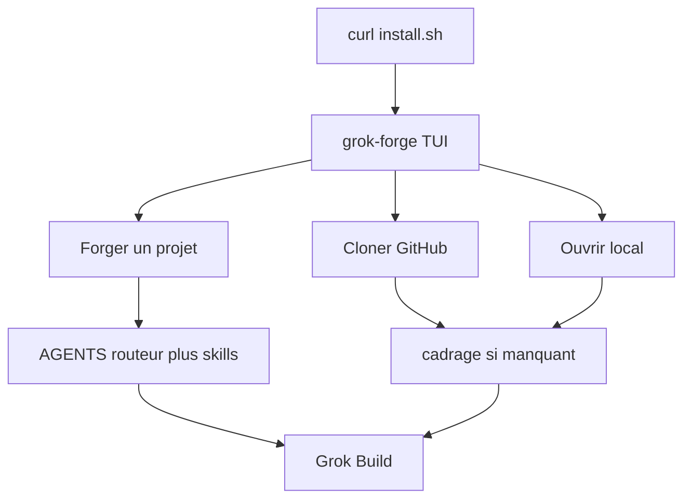
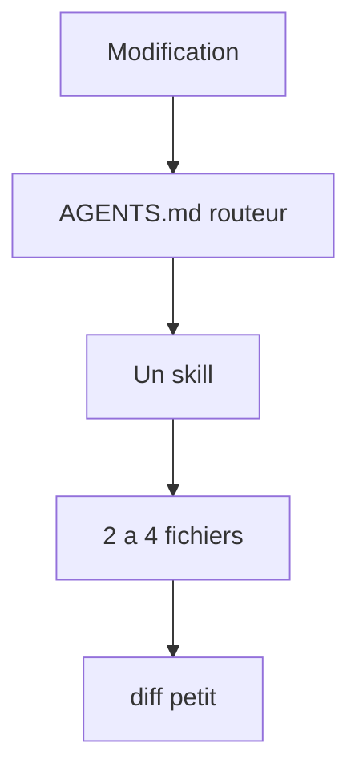

# Grok Forge

Installateur unifié et menu TUI pour travailler avec [Grok Build](https://x.ai/build) : installer les outils, forger un nouveau projet, ou cloner un dépôt déjà présent sur ton compte GitHub, puis laisser Grok coder et pousser proprement.

Cible : **Ubuntu / Linux**, stacks **Python**, **npm**, ou les deux. Interface plein écran inspirée du thème **GrokNight** de Grok Build.

Repo public : [palarchsys/grok-forge](https://github.com/palarchsys/grok-forge)

Grok lit **`AGENTS.md` seulement** au départ : c’est un **routeur**. Les procédures vivent dans `.grok/skills/` et ne s’ouvrent que si la table le dit. Ça limite les tokens à chaque modification.

---

## Installation (une ligne)

Dans un terminal Linux :

```bash
curl -fsSL https://raw.githubusercontent.com/palarchsys/grok-forge/main/install.sh | bash
```

Le script est **interactif** (il lit le clavier même via `curl | bash`). Il ne demande **aucun flag**.

Il va, dans l’ordre, si ce n’est pas déjà fait :

1. Installer les paquets de base (`git`, `curl`, `python3`, compilateur, etc.)
2. Installer **GitHub CLI** (`gh`) et proposer `gh auth login`
3. Installer **Grok Build** (`curl -fsSL https://x.ai/cli/install.sh | bash`)
4. Proposer **uv** (Python) et **Node LTS** via fnm
5. Cloner / **mettre à jour** (`git pull --ff-only`) cet outillage dans `~/.local/share/grok-forge`
6. Créer un **venv** pour le menu (`textual`) — jamais `pip install --user` (Ubuntu PEP 668)
7. Créer la commande `grok-forge` dans `~/.local/bin`

À la fin : *ouvrir le menu maintenant ?* → oui.

Les fois suivantes :

```bash
grok-forge
```

Le lanceur **tire tout seul** une mise à jour `ff-only` si `origin/main` a avancé, puis ouvre le menu.

**Clavier uniquement** : flèches haut/bas + Entrée (ou `1` / `2` / `3`). `Q` quitte. La souris est coupée exprès — sous GNOME Terminal elle envoyait des codes `^[[<35;…M` qui s’écrivaient dans la barre du haut et bloquaient les touches.

Pour forcer une mise à jour manuelle :

```bash
cd ~/.local/share/grok-forge && git pull --ff-only && grok-forge
```

---

## Cycle





Détail : [`docs/lifecycle.md`](docs/lifecycle.md). Carte : [`docs/map.md`](docs/map.md).

---

## Menu principal

Navigation : **flèches + Entrée**. Raccourcis : `1` forger, `2` cloner, `3` local, `Q` quitter. Échap revient d’un écran. Souris ignorée (voir plus haut).

| Choix | Effet |
| --- | --- |
| **Forger un nouveau projet** | Assistant (nom, type, options) → **plan à approuver** (`Ctrl+S`) → fichiers, venv / npm, `install.sh`, **AGENTS.md routeur + skills + mermaid**, repo GitHub créé ou branché, push initial |
| **Cloner un repo de mon GitHub** | Liste tes dépôts → clone (ou `git pull --ff-only` s’il est déjà là) → pose le cadrage **s’il manque** → ouvrir Grok |
| **Ouvrir un projet local** | Liste `~/GrokForge` → cadrage si besoin → `grok` |

Rien n’est écrit tant que tu n’as pas **approuvé le plan** (nouveau projet). Un `AGENTS.md` déjà présent n’est **jamais écrasé**.

---

## Types de projet

1. `python-cli` — outil / service Python
2. `python-web` — API (FastAPI par défaut)
3. `npm-web` — app Node
4. `fullstack` — backend Python + frontend npm
5. `linux-system` — scripts et units systemd

Chaque projet reçoit notamment :

- `AGENTS.md` — **routeur** (table : quelle skill ouvrir)
- `.grok/skills/{git,session,python,npm,linux}/SKILL.md` — procédures courtes
- `docs/lifecycle.md` — mermaid
- `docs/map.md` — carte des fichiers
- `install.sh` — seul point d’entrée local
- `install.ps1` seulement si tu as coché Windows
- socle Python / npm selon le type

Les **projets** vivent dans `~/GrokForge/`.
L’**outillage** (ce dépôt) vit dans `~/.local/share/grok-forge`.

---

## Git : créer, cloner, pousser

### Nouveau projet

- Si `gh` est connecté et que tu as accepté « créer le repo » : `gh repo create` + `git push -u origin main` pour le bootstrap.
- Ensuite le travail agent se fait sur `grok/<sujet>`, pas un force-push sur `main`.

### Repo déjà existant

Menu → cloner → `gh repo clone` (ou pull si le dossier existe).
Le remote `origin` est déjà le bon. Grok ouvre **dans** ce dossier.

### Fin de session

```bash
cd ~/GrokForge/ton-projet
.grok/hooks/session-wrap.sh "titre court"
```

Jamais de `--force` sur `main`. Jamais de `.env`, `.venv`, `node_modules` dans git.

---

## Relancer un projet depuis Git (machine neuve)

Sur le **projet** forgé, pas sur grok-forge :

```bash
git clone https://github.com/palarchsys/TON-PROJET.git
cd TON-PROJET
chmod +x install.sh
./install.sh
```

---

## Fichiers de ce dépôt

| Fichier | Rôle |
| --- | --- |
| `AGENTS.md` | Routeur pour Grok Build sur **ce** dépôt |
| `install.sh` | Bootstrap unifié (Grok Build + forge), interactif |
| `setup-grok-forge` | Lanceur TUI (`textual`) |
| `setup-grok-forge.sh` | Backend : génération du projet, git, GitHub |
| `forge_tui.py` | Menu GrokNight (nouveau / clone / local) |
| `templates/apply-framing.sh` | Pose le cadrage sans écraser |
| `templates/project/` | AGENTS + skills + mermaid copiés dans chaque projet |
| `.grok/skills/` | Skills de **ce** dépôt |
| `docs/lifecycle.md` | Cycle mermaid |
| `docs/map.md` | Carte |

---

## Prérequis

- Linux (Ubuntu 26.04 visé, Debian-like accepté)
- Compte [xAI / SuperGrok](https://x.ai) pour Grok Build
- Compte GitHub + `gh auth login` pour lister / créer / pousser tes repos
- Terminal vrai (TTY) pour la TUI

Aucun secret n’est stocké dans ce dépôt. L’auth GitHub passe par `gh` sur ta machine. L’auth Grok Build passe par le login officiel du CLI.

---

## Dépannage

**`grok-forge` introuvable**

```bash
export PATH="$HOME/.local/bin:$PATH"
```

**`externally-managed-environment` / `No module named 'textual'`**
Ubuntu 26.04 bloque `pip install --user`. Relance l’installateur : le menu vit dans son propre venv (`~/.local/share/grok-forge/.venv`).

```bash
curl -fsSL https://raw.githubusercontent.com/palarchsys/grok-forge/main/install.sh | bash
```

Puis `grok-forge`.

**`grok` introuvable** — relance `grok-forge` ou :

```bash
curl -fsSL https://x.ai/cli/install.sh | bash
```

**La TUI ne s’ouvre pas après `curl | bash`** — tape `grok-forge`.

**Codes `^[[<35;…M` dans la barre du haut, clavier mort**
Le terminal avait le tracking souris (mode 1003). C’est corrigé : mets à jour puis relance.

```bash
cd ~/.local/share/grok-forge && git pull --ff-only && grok-forge
```

Ensuite **flèches + Entrée** (la souris est ignorée exprès). `Q` quitte. `1` / `2` / `3` pour les trois actions.

**`gh repo list` vide**

```bash
gh auth login
gh auth setup-git
```

---

## Licence

MIT. Grok Build reste le produit d’xAI ; ce dépôt n’est que l’outillage de forge autour.
