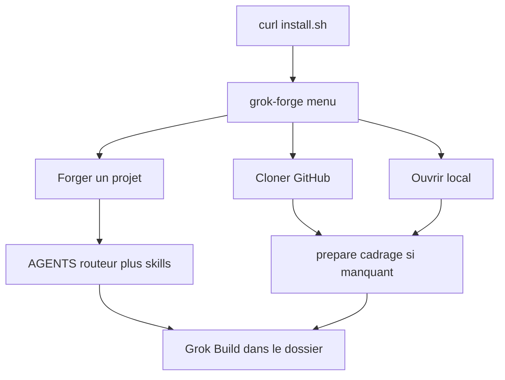
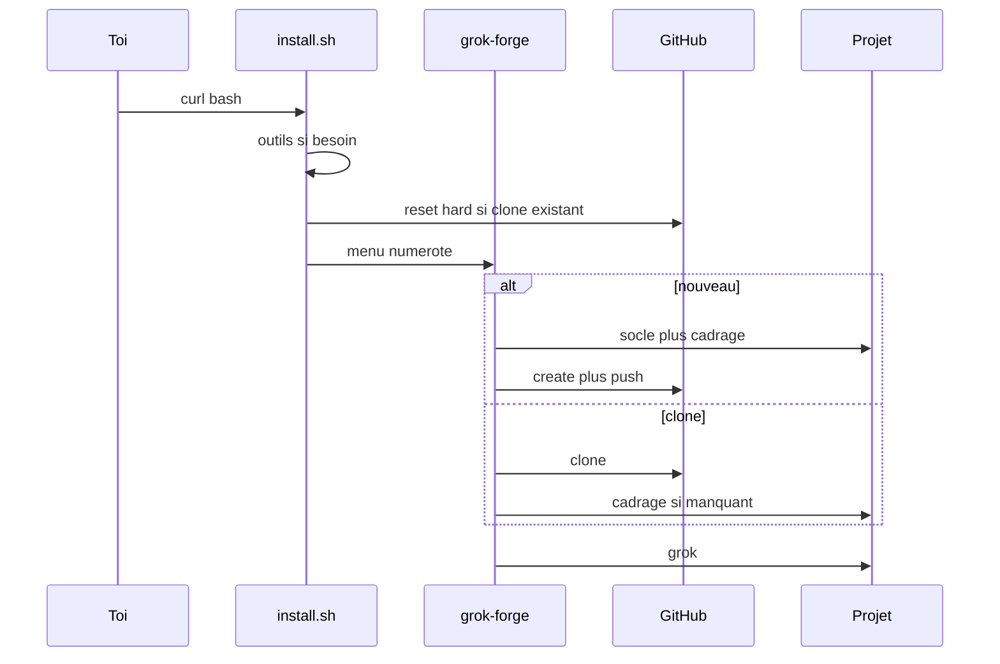
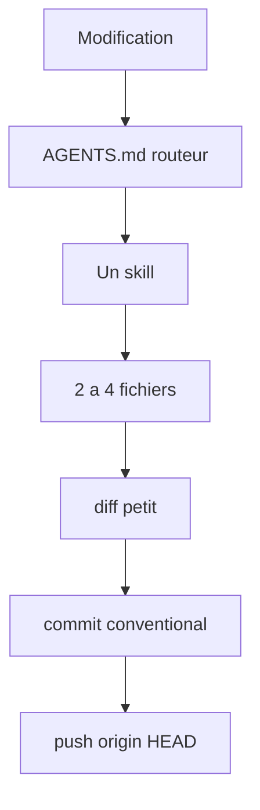

# Cycle de vie — Grok Forge

Ouvre ce fichier seulement pour comprendre le flux. Pas pour coder.

## Outillage (ce dépôt)

```mermaid
flowchart TB
  I[curl install.sh] --> T[grok-forge menu]
  T --> N[Forger un projet]
  T --> C[Cloner GitHub]
  T --> L[Ouvrir local]
  N --> F[AGENTS routeur plus skills]
  C --> P[prepare cadrage si manquant]
  L --> P
  F --> G[Grok Build dans le dossier]
  P --> G
```

```mermaid
sequenceDiagram
  participant U as Toi
  participant I as install.sh
  participant M as grok-forge
  participant R as GitHub
  participant P as Projet
  U->>I: curl bash
  I->>I: outils si besoin
  I->>R: reset hard si clone existant
  I->>M: menu numerote
  alt nouveau
    M->>P: socle plus cadrage
    M->>R: create plus push
  else clone
    M->>R: clone
    M->>P: cadrage si manquant
  end
  M->>P: grok
```

## Session Grok sur un projet forgé

```mermaid
flowchart TB
  Q[Modification] --> A[AGENTS.md routeur]
  A --> S[Un skill]
  S --> F[2 a 4 fichiers]
  F --> D[diff petit]
  D --> C[commit conventional]
  C --> P[push origin HEAD]
```
