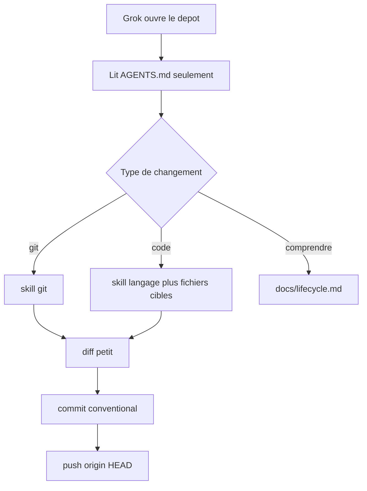
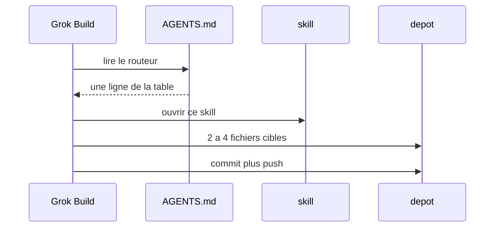

# Cycle de vie — __NAME__

Ouvre ce fichier seulement pour comprendre le flux. Pas pour coder.

```mermaid
flowchart TB
  A[Grok ouvre le depot] --> B[Lit AGENTS.md seulement]
  B --> C{Type de changement}
  C -->|git| D[skill git]
  C -->|code| E[skill langage plus fichiers cibles]
  C -->|comprendre| F[docs/lifecycle.md]
  D --> G[diff petit]
  E --> G
  G --> H[commit conventional]
  H --> I[push origin HEAD]
```

```mermaid
sequenceDiagram
  participant G as Grok Build
  participant A as AGENTS.md
  participant S as skill
  participant R as depot
  G->>A: lire le routeur
  A-->>G: une ligne de la table
  G->>S: ouvrir ce skill
  G->>R: 2 a 4 fichiers cibles
  G->>R: commit plus push
```
